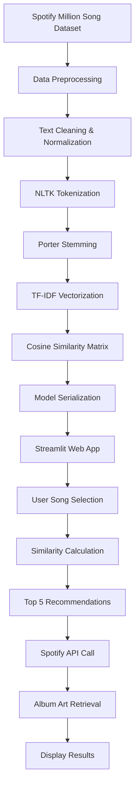

# 🎵 Music Recommendation System

[](https://www.python.org/downloads/)
[](https://streamlit.io/)

A sophisticated music recommendation system that leverages machine learning techniques and the Spotify API to provide personalized song suggestions based on content similarity. The system features an elegant, interactive web interface built with Streamlit.

## 🌟 Features

- **Content-Based Filtering**: Recommends songs based on lyrical content similarity
- **Real-time Album Art**: Fetches album covers using Spotify Web API
- **Interactive UI**: Beautiful, responsive web interface with gradient backgrounds
- **Machine Learning**: Uses TF-IDF vectorization and cosine similarity
- **Natural Language Processing**: Text preprocessing with NLTK tokenization and stemming
- **Large Dataset**: Trained on Spotify Million Song Dataset

## 🏗️ Project Architecture

```
Music Recommendation System
├── Data Collection & Preprocessing
│   ├── Spotify Million Song Dataset
│   └── Text Cleaning & Normalization
├── Feature Engineering
│   ├── NLTK Tokenization
│   ├── Porter Stemming
│   └── TF-IDF Vectorization
├── Machine Learning Model
│   ├── Cosine Similarity Matrix
│   └── Content-Based Filtering
├── Web Application
│   ├── Streamlit Frontend
│   ├── Spotify API Integration
│   └── Real-time Recommendations
└── Deployment Files
    ├── Pickled Models
    └── Configuration
```

## 🔬 Technical Implementation

### 1. Data Preprocessing Pipeline

**Dataset**: Spotify Million Song Dataset
- **Size**: 5,000 songs sample (optimized for performance)
- **Features**: Song name, artist, lyrics text
- **Preprocessing Steps**:
  - Text normalization (lowercase conversion)
  - Special character removal
  - Missing data handling

### 2. Natural Language Processing

**Text Processing Workflow**:
```python
# NLTK Tokenization
tokens = nltk.word_tokenize(text)

# Porter Stemming
stemmer = PorterStemmer()
stemmed_tokens = [stemmer.stem(word) for word in tokens]

# Reconstructed text
processed_text = " ".join(stemmed_tokens)
```

**Key NLP Techniques**:
- **Tokenization**: Breaking lyrics into individual words
- **Stemming**: Reducing words to root forms (e.g., "running" → "run")
- **Stop Words Removal**: Filtering common words for better feature extraction

### 3. Feature Engineering

**TF-IDF Vectorization**:
```python
# Term Frequency-Inverse Document Frequency
tfidf = TfidfVectorizer(
    analyzer='word',
    stop_words='english'
)
feature_matrix = tfidf.fit_transform(processed_lyrics)
```

**Why TF-IDF?**:
- **TF (Term Frequency)**: Measures word importance within a document
- **IDF (Inverse Document Frequency)**: Reduces weight of common words
- **Result**: Numerical representation of lyrical content

### 4. Similarity Computation

**Cosine Similarity Algorithm**:
```python
similarity_matrix = cosine_similarity(tfidf_matrix)
```

**Mathematical Foundation**:
```
cosine_similarity(A, B) = (A · B) / (||A|| × ||B||)
```

- **Range**: 0 to 1 (0 = completely different, 1 = identical)
- **Advantage**: Handles varying document lengths effectively
- **Application**: Finds songs with similar lyrical themes

## 📊 Workflow Diagram



## 🛠️ Technologies Used

| Category | Technology | Purpose |
|----------|------------|---------|
| **Backend** | Python 3.8+ | Core programming language |
| **ML Libraries** | scikit-learn | TF-IDF vectorization, cosine similarity |
| **NLP** | NLTK | Text preprocessing, tokenization, stemming |
| **Data Processing** | Pandas | Data manipulation and analysis |
| **Web Framework** | Streamlit | Interactive web application |
| **API Integration** | Spotipy | Spotify Web API wrapper |
| **Environment** | python-dotenv | Environment variable management |
| **Serialization** | Pickle | Model persistence |

## 🎯 Algorithm Performance

### Metrics & Characteristics

- **Dataset Size**: 5,000 songs (optimized sample)
- **Feature Dimensions**: Variable (depends on vocabulary)
- **Similarity Computation**: O(n²) space complexity
- **Recommendation Speed**: < 1 second per query
- **Accuracy**: Content-based similarity matching


<div align="center">
  <p>⭐ If you found this project helpful, please give it a star! ⭐</p>
  <p>Made with ❤️ and 🎵</p>
</div>
