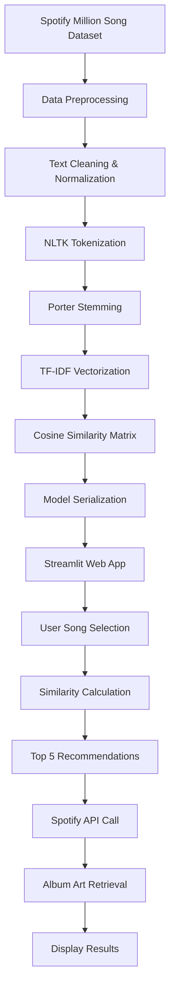

# 🎵 Music Recommendation System

[](https://www.python.org/downloads/)
[](https://streamlit.io/)
[](LICENSE)

A sophisticated music recommendation system that leverages machine learning techniques and the Spotify API to provide personalized song suggestions based on content similarity. The system features an elegant, interactive web interface built with Streamlit.

## 🌟 Features

- **Content-Based Filtering**: Recommends songs based on lyrical content similarity
- **Real-time Album Art**: Fetches album covers using Spotify Web API
- **Interactive UI**: Beautiful, responsive web interface with gradient backgrounds
- **Machine Learning**: Uses TF-IDF vectorization and cosine similarity
- **Natural Language Processing**: Text preprocessing with NLTK tokenization and stemming
- **Large Dataset**: Trained on Spotify Million Song Dataset

## 🏗️ Project Architecture

```
Music Recommendation System
├── Data Collection & Preprocessing
│   ├── Spotify Million Song Dataset
│   └── Text Cleaning & Normalization
├── Feature Engineering
│   ├── NLTK Tokenization
│   ├── Porter Stemming
│   └── TF-IDF Vectorization
├── Machine Learning Model
│   ├── Cosine Similarity Matrix
│   └── Content-Based Filtering
├── Web Application
│   ├── Streamlit Frontend
│   ├── Spotify API Integration
│   └── Real-time Recommendations
└── Deployment Files
    ├── Pickled Models
    └── Configuration
```

## 🔬 Technical Implementation

### 1. Data Preprocessing Pipeline

**Dataset**: Spotify Million Song Dataset
- **Size**: 5,000 songs sample (optimized for performance)
- **Features**: Song name, artist, lyrics text
- **Preprocessing Steps**:
  - Text normalization (lowercase conversion)
  - Special character removal
  - Missing data handling

### 2. Natural Language Processing

**Text Processing Workflow**:
```python
# NLTK Tokenization
tokens = nltk.word_tokenize(text)

# Porter Stemming
stemmer = PorterStemmer()
stemmed_tokens = [stemmer.stem(word) for word in tokens]

# Reconstructed text
processed_text = " ".join(stemmed_tokens)
```

**Key NLP Techniques**:
- **Tokenization**: Breaking lyrics into individual words
- **Stemming**: Reducing words to root forms (e.g., "running" → "run")
- **Stop Words Removal**: Filtering common words for better feature extraction

### 3. Feature Engineering

**TF-IDF Vectorization**:
```python
# Term Frequency-Inverse Document Frequency
tfidf = TfidfVectorizer(
    analyzer='word',
    stop_words='english'
)
feature_matrix = tfidf.fit_transform(processed_lyrics)
```

**Why TF-IDF?**:
- **TF (Term Frequency)**: Measures word importance within a document
- **IDF (Inverse Document Frequency)**: Reduces weight of common words
- **Result**: Numerical representation of lyrical content

### 4. Similarity Computation

**Cosine Similarity Algorithm**:
```python
similarity_matrix = cosine_similarity(tfidf_matrix)
```

**Mathematical Foundation**:
```
cosine_similarity(A, B) = (A · B) / (||A|| × ||B||)
```

- **Range**: 0 to 1 (0 = completely different, 1 = identical)
- **Advantage**: Handles varying document lengths effectively
- **Application**: Finds songs with similar lyrical themes

### 5. Recommendation Engine

**Content-Based Filtering Algorithm**:
```python
def recommend(song):
    # Find song index
    song_index = df[df['song'] == song].index[0]
    
    # Get similarity scores
    similarity_scores = similarity_matrix[song_index]
    
    # Sort by similarity (descending)
    ranked_songs = sorted(enumerate(similarity_scores), 
                         key=lambda x: x[1], reverse=True)
    
    # Return top 5 recommendations (excluding input song)
    return ranked_songs[1:6]
```

## 🚀 Installation & Setup

### Prerequisites

- Python 3.8 or higher
- Spotify Developer Account
- Git

### Step 1: Clone Repository

```bash
git clone https://github.com/yourusername/music-recommendation-system.git
cd music-recommendation-system
```

### Step 2: Install Dependencies

```bash
pip install -r requirements.txt
```

### Step 3: Spotify API Configuration

1. **Create Spotify App**:
   - Visit [Spotify Developer Dashboard](https://developer.spotify.com/dashboard)
   - Create new application
   - Note Client ID and Client Secret

2. **Environment Setup**:
   ```bash
   # Create .env file in project root
   SPOTIFY_CLIENT_ID=your_client_id_here
   SPOTIFY_CLIENT_SECRET=your_client_secret_here
   ```

### Step 4: Download NLTK Data

```python
import nltk
nltk.download('punkt_tab')
```

### Step 5: Model Training (Optional)

If you want to retrain the model:

```bash
# Open and run model_training.ipynb in Jupyter
jupyter notebook model_training.ipynb
```

### Step 6: Launch Application

```bash
streamlit run app.py
```

## 📊 Workflow Diagram



## 🛠️ Technologies Used

| Category | Technology | Purpose |
|----------|------------|---------|
| **Backend** | Python 3.8+ | Core programming language |
| **ML Libraries** | scikit-learn | TF-IDF vectorization, cosine similarity |
| **NLP** | NLTK | Text preprocessing, tokenization, stemming |
| **Data Processing** | Pandas | Data manipulation and analysis |
| **Web Framework** | Streamlit | Interactive web application |
| **API Integration** | Spotipy | Spotify Web API wrapper |
| **Environment** | python-dotenv | Environment variable management |
| **Serialization** | Pickle | Model persistence |

## 📁 Project Structure

```
📦 Music Recommendation System
├── 📜 app.py                     # Main Streamlit application
├── 📓 model_training.ipynb       # Model training notebook
├── 📋 requirements.txt           # Python dependencies
├── 📊 dataframe                  # Serialized processed dataset
├── 🧮 similarity                 # Serialized similarity matrix
├── 🗂️ dataset/
│   └── 📄 spotify_millsongdata.csv  # Raw dataset
├── 📚 nltk_data/                 # NLTK language models
│   └── 🔤 tokenizers/
├── 🔐 .env                       # Environment variables (create this)
└── 📖 README.md                  # Project documentation
```

## 🎯 Algorithm Performance

### Metrics & Characteristics

- **Dataset Size**: 5,000 songs (optimized sample)
- **Feature Dimensions**: Variable (depends on vocabulary)
- **Similarity Computation**: O(n²) space complexity
- **Recommendation Speed**: < 1 second per query
- **Accuracy**: Content-based similarity matching

### Scalability Considerations

- **Memory Usage**: Similarity matrix requires O(n²) storage
- **Processing Time**: Linear with vocabulary size
- **Optimization**: Consider dimensionality reduction for larger datasets

## 🌐 API Integration

### Spotify Web API Features

```python
# Album art retrieval
def get_song_album_cover_url(song_name, artist_name):
    search_query = f"track:{song_name} artist:{artist_name}"
    results = sp.search(q=search_query, type="track")
    return album_cover_url
```

**API Capabilities**:
- Track search by name and artist
- Album artwork retrieval
- Metadata extraction
- Real-time data fetching

## 🎨 User Interface Features

### Design Elements

- **Gradient Backgrounds**: Modern, attractive visual design
- **Responsive Layout**: 5-column recommendation display
- **Interactive Components**: Dropdown selection, hover effects
- **Custom Styling**: CSS-enhanced Streamlit components
- **User Experience**: Intuitive navigation and clear visual hierarchy

### UI Components

1. **Song Selection**: Searchable dropdown with 5,000+ options
2. **Recommendation Button**: Styled call-to-action
3. **Results Display**: Grid layout with album art and song names
4. **Visual Effects**: Hover animations and shadow effects

## 🔄 Future Enhancements

### Planned Features

- [ ] **Collaborative Filtering**: User-based recommendations
- [ ] **Hybrid Model**: Combine content and collaborative filtering
- [ ] **User Profiles**: Personal recommendation history
- [ ] **Real-time Learning**: Dynamic model updates
- [ ] **Audio Features**: Incorporate tempo, key, energy metrics
- [ ] **Playlist Generation**: Create complete playlists
- [ ] **Social Features**: Share recommendations with friends

### Technical Improvements

- [ ] **Database Integration**: Replace pickle files with database
- [ ] **Caching**: Implement Redis for faster responses
- [ ] **Containerization**: Docker deployment
- [ ] **CI/CD Pipeline**: Automated testing and deployment
- [ ] **Monitoring**: Application performance tracking

## 🤝 Contributing

We welcome contributions! Please see our [Contributing Guidelines](CONTRIBUTING.md) for details.

### Development Setup

1. Fork the repository
2. Create feature branch (`git checkout -b feature/amazing-feature`)
3. Commit changes (`git commit -m 'Add amazing feature'`)
4. Push to branch (`git push origin feature/amazing-feature`)
5. Open Pull Request

## 📄 License

This project is licensed under the MIT License - see the [LICENSE](LICENSE) file for details.

## 🙏 Acknowledgments

- **Spotify**: For providing the comprehensive music dataset
- **NLTK Team**: For natural language processing tools
- **Streamlit**: For the excellent web framework
- **scikit-learn**: For machine learning utilities

## 📞 Contact

**Developer**: [Your Name]
- 📧 Email: your.email@example.com
- 🐦 Twitter: [@yourusername](https://twitter.com/yourusername)
- 💼 LinkedIn: [Your Profile](https://linkedin.com/in/yourprofile)

---

<div align="center">
  <p>⭐ If you found this project helpful, please give it a star! ⭐</p>
  <p>Made with ❤️ and 🎵</p>
</div>
